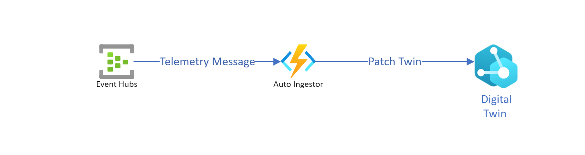

# Azure Digital Twin Auto Ingestor
[](https://github.com/WaywardHayward/adt-auto-ingestor/actions/workflows/dotnet.yml)
> Function app which Auto ingests data from an Event Hub into Azure Digital Twins

## How to Run the Function Locally

To debug this function locally in vscode you will require the following items.

- [Visual Studio Code](https://code.visualstudio.com/)
- [Azure Tools Extension](https://marketplace.visualstudio.com/items?itemName=ms-vscode.vscode-node-azure-pack)
- [Azure Functions Core Tools](https://github.com/Azure/azure-functions-core-tools#installing)

_ℹ️ You must have [Access to the Azure Digital Twins instance](https://docs.microsoft.com/en-us/azure/digital-twins/how-to-set-up-instance-powershell#set-up-user-access-permissions "More on how to grand access to an Azure Digital Twins Instance can be found here.") you are running against __and__ have the role "Azure Digital Twins Data Owner" as a minimum to run this function app._

This function app uses dotnetcore 3.1 LTS to build and run it use the standard dotnet commands from within the src directory

```sh
cd src
```

```sh
dotnet restore
```

```sh
dotnet build
```

This function app makes use of a local.settings.json file which you must populate with settings described in the [Settings](#Function_App_Settings) section below.

## Architecture

The function app is designed to ingest data from an Event Hub into Azure Digital Twins using the following architecture.



## Function App Settings

The following settings are required on top of the standard Azure Function app settings to run the function.

| Setting Name | Type | Description |
| ------------ | ---- | ----------- |
| INGESTION_EVENTHUB_CONNECTION_STRING | string | This is the connection string for the event hub you want to connect to |
| INGESTION_EVENTHUB_NAME | string | This is the name of the event hub you want to connect to |
| INGESTION_EVENTHUB_CONSUMERGROUP | string | The Consumer Group you want to use to listen to the event hub with |
| INGESTION_TWIN_URL | string | The fully qualified Azure Digital Twins instance url https://\<your-instance-name\>.api.\<your-instance-location-shortcode\>.digitaltwins.azure.net |
| INGESTION_ADT_TWIN_IDENTIFIERS | string | An Optional Property, comprising of a semi-colon separated list of Json Paths to extract the Twin Identifier from the Generic Messages. if not supplied the Path message.DeviceId or the iot-device-identifier from the message properties are used. |
| INGESTION_MODEL_IDENTIFIERS | string | An Optional Property, comprising of a semi-colon separated list of Json Paths to extract the Model Identifier from the Generic Messages. if not supplied the Path message.ModelId or the iot-model-identifier from the message properties are used. |
| INGESTION_TIMESTAMP_IDENTIFIERS | string | An Optional Property, comprising of a semi-colon separated list of Json Paths to extract the Timestamp from the Generic Messages. if not supplied the The current time in UTC is used  |
| INGESTION_OPC_ENABLED | boolean | An Optional Property, defines if the function app should auto ingest OPC Sensors - when not supplied is treated as false |
| INGESTION_GENERIC_ENABLED | boolean | An Optional Property, defines if the function app should auto ingest any messages - when not supplied is treated as false |

  _ℹ️ The Azure Function App must run with a [Managed Identity](https://docs.microsoft.com/en-us/azure/active-directory/managed-identities-azure-resources/overview "Find out more about Azure Managed Identities Here") which has Access to the Azure Digital Twins instance you are running against __and__ have the role "Azure Digital Twins Data Owner" as a minimum to run this function app._

## OPC Message Ingestion

When the flag __INGESTION_OPC_ENABLED__ is set to true, the function will ingest messages which are identified as OPC messages into a Twin.

The function will automatically provision an OPC Sensor Model and create a twin per OPC Node Id it detects.

An OPC Twin Node Id is made of the following

```text
ApplicationUri + (NodeId or Id) 
```

A message is identified as an OPC Message by the presence of the following properties.

- NodeId
- ApplicationUri
- Value

### Expected OPC Message Format

The expected OPC message format expected is one of the two schemas referenced below

```json

 {
      "NodeId": "i=2058",
      "ApplicationUri": "urn:myopcserver",
      "DisplayName": "CurrentTime",
      "Value": {
          "Value": "10.11.2017 14:03:17",
          "SourceTimestamp": "2017-11-10T14:03:17Z"
      }
  }

```

or

```json

 {
      "NodeId": "i=2058",
      "ApplicationUri": "urn:myopcserver",
      "DisplayName": "CurrentTime",
      "Value": "10.11.2017 14:03:17",
      "SourceTimestamp": "2017-11-10T14:03:17Z"
  }

```

## Generic Message Ingestion

When the flag __INGESTION_GENERIC_ENABLED__ is set to true, the function will ingest all messages (other than OPC and TIQ messages if enabled) into a Twin.

*Trademarks This project may contain trademarks or logos for projects, products, or services. Authorized use of Microsoft trademarks or logos is subject to and must follow Microsoft’s Trademark & Brand Guidelines. Use of Microsoft trademarks or logos in modified versions of this project must not cause confusion or imply Microsoft sponsorship. Any use of third-party trademarks or logos are subject to those third-party’s policies.*
